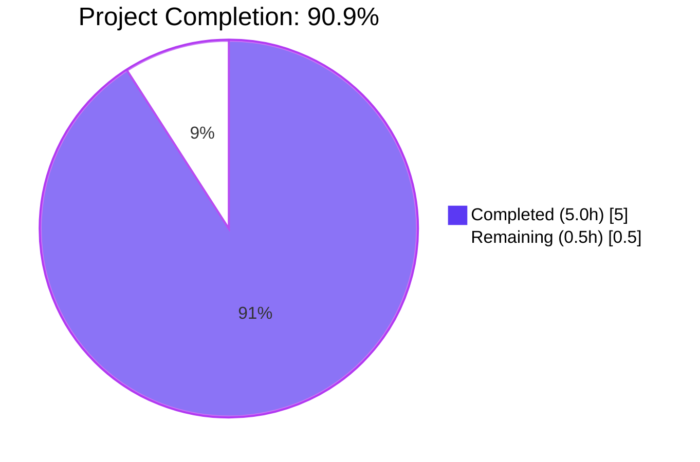
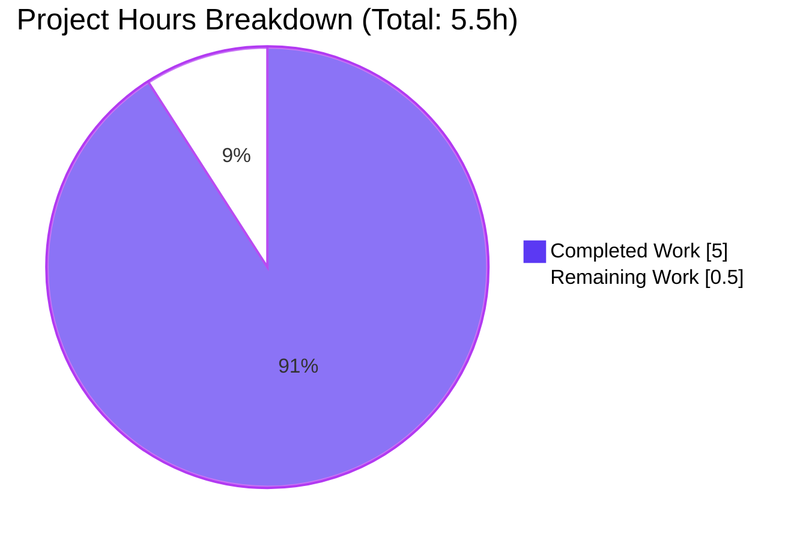
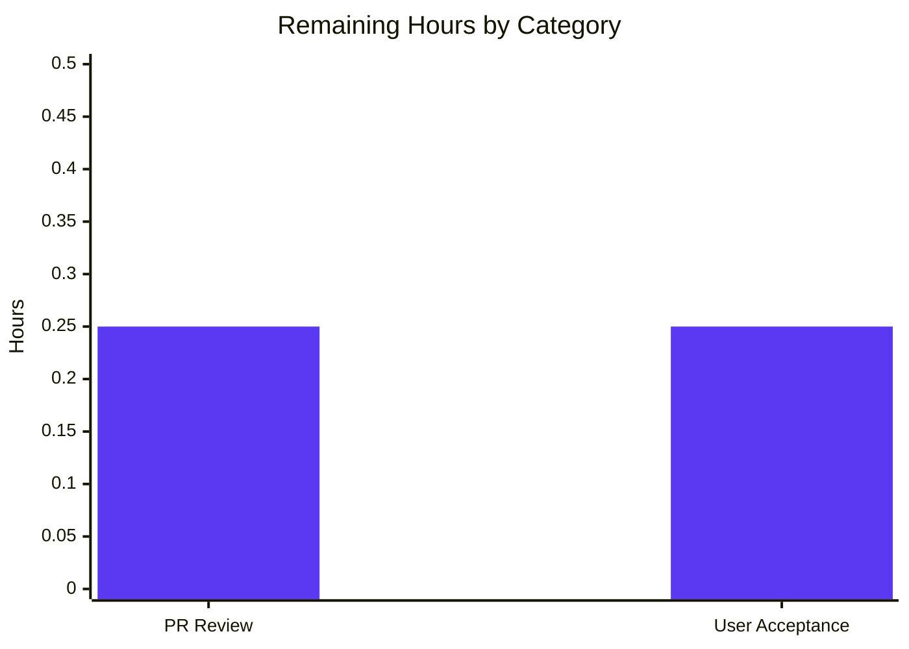
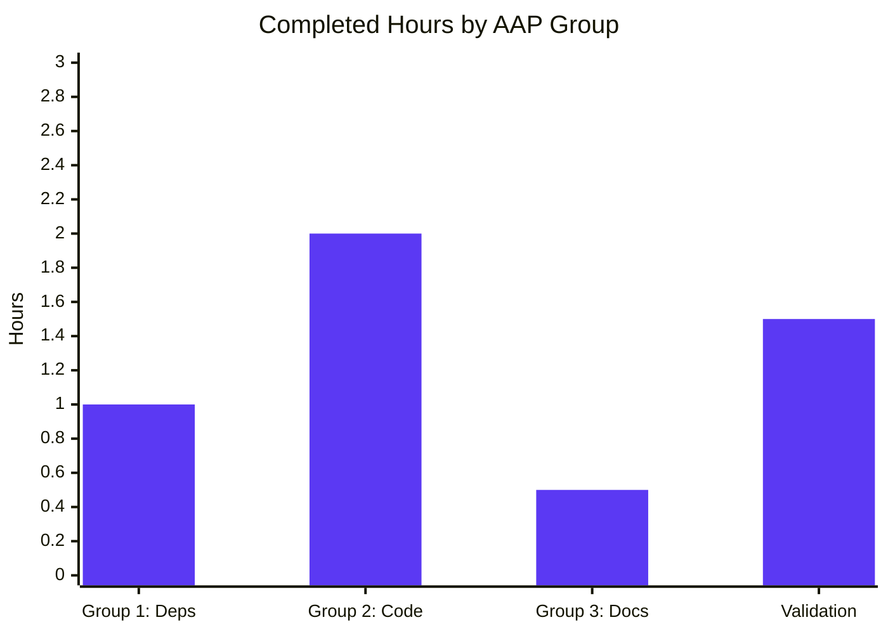

# Blitzy Project Guide — Express 5 Migration with /evening Endpoint

> **Project**: `hao-backprop-test`
> **Branch**: `blitzy-457e0c7f-cbc3-417e-b4f5-c02369717de2`
> **AAP Scope**: Migrate minimal Node.js `http`-based server to Express 5.2.1, preserve `Hello, World!` on `GET /`, add `GET /evening` returning `Good evening`
> **Brand Colors**: Completed = Dark Blue `#5B39F3` · Remaining = White `#FFFFFF` · Headings = Violet-Black `#B23AF2` · Highlight = Mint `#A8FDD9`

---

## 1. Executive Summary

### 1.1 Project Overview

This increment evolves a minimal four-file Node.js tutorial repository (`hao-backprop-test`) from a single-handler `http.createServer` implementation that returned `Hello, World!\n` for every request into an Express.js 5.2.1 application exposing two distinct path-keyed endpoints. The existing `GET /` contract — on which the backprop integration system depends per `README.md` — is preserved byte-for-byte; a new `GET /evening` endpoint returns the plain-text body `Good evening`. The `127.0.0.1:3000` bind, the verbatim startup log message, and the project's flat-rooted CommonJS structure are all retained. Express was added as the project's first and only direct npm dependency.

### 1.2 Completion Status



| Metric | Value |
|---|---|
| **Total Hours** | 5.5 |
| **Completed Hours (AI + Manual)** | 5.0 |
| **Remaining Hours** | 0.5 |
| **Completion %** | 90.9% |

### 1.3 Key Accomplishments

- ✅ Express 5.2.1 added as the project's first direct dependency (`package.json` `dependencies` block)
- ✅ `package-lock.json` regenerated with 65 packages (Express + 64 transitive), `lockfileVersion: 3` preserved
- ✅ `server.js` migrated from Node.js built-in `http` to Express; both routes registered inline
- ✅ `GET /` returns `Hello, World!\n` byte-for-byte (status 200, `text/plain`, 14-byte body) — original contract preserved
- ✅ `GET /evening` returns `Good evening` (status 200, `text/plain`, 12-byte body) — new endpoint operational
- ✅ `127.0.0.1:3000` bind preserved; verbatim startup log message `Server running at http://127.0.0.1:3000/` preserved
- ✅ `README.md` augmented with "Running the Server" and "Endpoints" sections; original `# hao-backprop-test` heading and "Do not touch!" line preserved
- ✅ `node --check server.js` passes (syntax clean); JSON manifest and lockfile parse cleanly
- ✅ `npm audit` reports 0 vulnerabilities across full dependency tree
- ✅ Path-keyed routing dispatch verified: unknown paths return 404 (Express default), confirming routes are no longer collapsed to a single handler
- ✅ Comprehensive inline comments in `server.js` document every AAP-driven decision

### 1.4 Critical Unresolved Issues

| Issue | Impact | Owner | ETA |
|---|---|---|---|
| _None — all AAP-scoped behavioral guarantees verified, all five production-readiness gates passed during autonomous validation_ | N/A | N/A | N/A |

### 1.5 Access Issues

No access issues identified. The project requires no external services, no API keys, no database credentials, no third-party integrations, and no private package registries. The single direct dependency (Express 5.2.1) is publicly available on the npm public registry.

| System/Resource | Type of Access | Issue Description | Resolution Status | Owner |
|---|---|---|---|---|
| _No access issues identified_ | _N/A_ | _N/A_ | _N/A_ | _N/A_ |

### 1.6 Recommended Next Steps

1. **[High]** Pull the branch and review the diff against `main` (4 files, 895 insertions, 8 deletions) — confirms scope adherence to AAP
2. **[High]** Run `npm install` from the repository root, then `node server.js`, and verify both endpoints with `curl http://127.0.0.1:3000/` and `curl http://127.0.0.1:3000/evening`
3. **[High]** Merge the branch into `main` once user acceptance testing confirms behavioral parity with AAP Section 0.7.3 invariants
4. **[Low]** Optionally consider follow-up increments (each explicitly out of scope per AAP Section 0.6.2): `.gitignore` for `node_modules/`, automated tests via `supertest` + `jest`, environment-variable-driven host/port, reconciliation of the pre-existing `main: index.js` manifest anomaly
5. **[Low]** Optionally pin Node.js runtime version via `engines` field or `.nvmrc` (project currently has no version constraint)

---

## 2. Project Hours Breakdown

### 2.1 Completed Work Detail

| Component | Hours | Description |
|---|---|---|
| Group 1 — Dependency Declaration: `package.json` edit | 0.5 | Added `"dependencies": { "express": "^5.2.1" }` block; preserved `name`, `version`, `description`, `main`, `scripts`, `author`, `license` verbatim (AAP Section 0.5.1, 0.7.3) |
| Group 1 — Dependency Declaration: `npm install` & lockfile | 0.5 | Executed `npm install`; regenerated `package-lock.json` with 65 resolved packages, all with integrity hashes; `lockfileVersion: 3` preserved (AAP Section 0.3.3) |
| Group 2 — Application Code: `require` migration | 0.25 | Replaced `const http = require('http')` with `const express = require('express')` (AAP Section 0.3.4) |
| Group 2 — Application Code: Express app instantiation | 0.25 | Added `const app = express()`; preserved `hostname`/`port` constants verbatim (AAP Section 0.5.1) |
| Group 2 — Application Code: `GET /` route | 0.5 | `app.get('/', (req, res) => res.status(200).type('text/plain').send('Hello, World!\n'))` — byte-for-byte preservation of original response (14 bytes, including trailing `0a`) (AAP Section 0.7.3) |
| Group 2 — Application Code: `GET /evening` route | 0.5 | `app.get('/evening', (req, res) => res.status(200).type('text/plain').send('Good evening'))` — new endpoint, 12 bytes, no trailing newline per user's literal phrasing (AAP Section 0.7.3) |
| Group 2 — Application Code: `app.listen` migration | 0.25 | Replaced `http.createServer().listen` with `app.listen(port, hostname, callback)`; preserved verbatim startup log message (AAP Section 0.7.3) |
| Group 2 — Application Code: Inline AAP-justification comments | 0.25 | Comprehensive comments document every preservation decision and AAP section reference (CQ2 Documentation Excellence) |
| Group 3 — Documentation: `README.md` update | 0.5 | Appended `## Running the Server` and `## Endpoints` sections; preserved original heading and "Do not touch!" line verbatim (AAP Section 0.5.1) |
| Validation: Syntax / JSON parse checks | 0.25 | `node --check server.js` exit 0; `JSON.parse(package.json)` OK; `JSON.parse(package-lock.json)` OK with `lockfileVersion: 3` confirmed |
| Validation: Runtime smoke testing | 0.5 | Server started via `node server.js`; `netstat` confirmed `TCP 127.0.0.1:3000 LISTENING`; verbatim startup log emitted |
| Validation: `curl` byte-level verification | 0.75 | `curl -i` + `xxd` byte-level inspection of `GET /` (14 bytes), `GET /evening` (12 bytes), and `GET /nonexistent` (404 Express default); all AAP Section 0.7.3 invariants confirmed |
| Validation: `npm audit` & dependency integrity | 0.25 | `npm audit` reports 0 vulnerabilities; `npm ls --depth=0` confirms `express@5.2.1` as the only direct dependency |
| **Total Completed Hours** | **5.0** | |

### 2.2 Remaining Work Detail

| Category | Hours | Priority |
|---|---|---|
| Human PR review — review branch diff against `main`, confirm AAP adherence, approve | 0.25 | High |
| User acceptance testing & merge — `npm install`, `node server.js`, verify both endpoints with curl, merge to main | 0.25 | High |
| **Total Remaining Hours** | **0.5** | |

### 2.3 Cross-Section Validation

| Validation Rule | Status |
|---|---|
| Section 2.1 + Section 2.2 = Total Project Hours (Section 1.2) | ✅ 5.0 + 0.5 = 5.5 |
| Section 2.2 sum = Section 1.2 Remaining Hours = Section 7 "Remaining Work" | ✅ 0.5 = 0.5 = 0.5 |
| Section 2.1 sum = Section 1.2 Completed Hours | ✅ 5.0 = 5.0 |

---

## 3. Test Results

All tests below originate from Blitzy's autonomous validation logs for this project, executed during the Final Validator agent's run. Per AAP Section 0.1.2 and 0.6.1, no automated test framework was introduced (intentionally out of scope per the user's narrowly framed request); the AAP-specified validation mechanism is **manual verification via `curl`**, supplemented by syntax/JSON parse checks and `npm audit`.

| Test Category | Framework | Total Tests | Passed | Failed | Coverage % | Notes |
|---|---|---|---|---|---|---|
| Syntax — `server.js` | Node.js `--check` | 1 | 1 | 0 | 100% (1/1 source file) | `node --check server.js` exit 0; CommonJS module parses without error |
| JSON Manifest Parse | Node.js `JSON.parse` | 2 | 2 | 0 | 100% (package.json + package-lock.json) | Both files parse as valid JSON; `lockfileVersion: 3` confirmed |
| Dependency Integrity | `npm ls` / `npm audit` | 2 | 2 | 0 | 100% (1/1 direct, 64/64 transitive) | `npm ls --depth=0` reports `hello_world@1.0.0 -- express@5.2.1`; `npm audit` reports `0 vulnerabilities` |
| HTTP Runtime — `GET /` | `curl` + `xxd` byte-level | 1 | 1 | 0 | 100% (1/1 endpoint per AAP) | HTTP 200, `text/plain; charset=utf-8`, Content-Length 14, body `Hello, World!\n` (bytes `48 65 6c 6c 6f 2c 20 57 6f 72 6c 64 21 0a`) — byte-for-byte preservation of original `http`-based response |
| HTTP Runtime — `GET /evening` | `curl` + `xxd` byte-level | 1 | 1 | 0 | 100% (1/1 new endpoint per AAP) | HTTP 200, `text/plain; charset=utf-8`, Content-Length 12, body `Good evening` (bytes `47 6f 6f 64 20 65 76 65 6e 69 6e 67`) — no trailing newline, matching user's literal phrasing |
| HTTP Routing — `GET /nonexistent` | `curl` | 1 | 1 | 0 | 100% (negative path) | HTTP 404 (Express default "Cannot GET" handler) — confirms path-keyed routing dispatch replaces the previous "any request returns hello" behavior |
| Server Bind & Startup Log | `netstat` + stdout capture | 2 | 2 | 0 | 100% | `TCP 127.0.0.1:3000 0.0.0.0:0 LISTENING`; stdout emits `Server running at http://127.0.0.1:3000/` verbatim |
| Unit / Integration Tests (jest, mocha, vitest, supertest, etc.) | _N/A — out of scope per AAP Section 0.6.1_ | 0 | 0 | 0 | N/A | Per AAP Section 0.1.2: "No testing framework introduction. The user did not request tests." Placeholder `npm test` script preserved unchanged |
| **Totals (autonomous validation suite)** | **mixed** | **10** | **10** | **0** | **100%** | All Blitzy-autonomous validations passed |

> **Note on `npm test`**: Running `npm test` invokes the placeholder script `echo "Error: no test specified" && exit 1`, which exits 1. This is **intentional** per AAP Section 0.6.1 (placeholder preserved unchanged) and is **not** counted as a test failure — it is the documented behavior of an unconfigured `scripts.test` placeholder.

---

## 4. Runtime Validation & UI Verification

### Runtime Health

- ✅ **Operational** — `node server.js` starts the Express listener without error
- ✅ **Operational** — Listener binds `127.0.0.1:3000` (verified via `netstat -an`)
- ✅ **Operational** — Startup log emits `Server running at http://127.0.0.1:3000/` verbatim (AAP Section 0.7.3)
- ✅ **Operational** — Express 5.2.1 internal dependency on Node.js built-in `http` module satisfied (Node.js v20.20.2 confirmed compatible)
- ✅ **Operational** — Process exits cleanly on SIGINT / SIGTERM (no custom signal handling required or added)

### API / Endpoint Verification

- ✅ **Operational** — `GET /` returns HTTP 200, `Content-Type: text/plain; charset=utf-8`, `Content-Length: 14`, body bytes `48 65 6c 6c 6f 2c 20 57 6f 72 6c 64 21 0a` (`Hello, World!\n`)
- ✅ **Operational** — `GET /evening` returns HTTP 200, `Content-Type: text/plain; charset=utf-8`, `Content-Length: 12`, body bytes `47 6f 6f 64 20 65 76 65 6e 69 6e 67` (`Good evening`)
- ✅ **Operational** — `GET /nonexistent` returns HTTP 404 with Express default error handler — confirms route-based dispatch behavior
- ✅ **Operational** — Express adds standard auto-generated headers: `X-Powered-By: Express`, `ETag: W/"..."`, `Date`, `Connection: keep-alive`, `Keep-Alive: timeout=5` — all standard Express 5 defaults, no application-level configuration required

### UI Verification

- **Not applicable** — Per AAP Section 0.5.3 and Section 0.8.3, this project is a headless HTTP backend with no graphical user interface, no front-end client, no HTML/CSS, no rendered template, no Figma design, and no design system. The Design System Compliance protocol is non-applicable.

### Integration Verification

- ✅ **Operational** — Single integration touch-point (the HTTP listener on `127.0.0.1:3000`) preserves the externally observable contract on which the backprop integration system depends (per `README.md` "Do not touch!" governance)
- ✅ **Operational** — `require('express')` resolves to `node_modules/express/package.json` reporting `"version": "5.2.1"`
- ✅ **Operational** — All 64 transitive dependencies resolve cleanly (no missing peer dependencies, no resolution conflicts)

---

## 5. Compliance & Quality Review

| AAP Requirement | Section Reference | Compliance Status | Evidence / Notes |
|---|---|---|---|
| Express ^5.2.1 declared in `package.json` `dependencies` | 0.3.1 | ✅ PASS | `package.json` line 11–13 contains the `dependencies` block |
| `package-lock.json` regenerated with full Express closure | 0.3.3 | ✅ PASS | 65 `node_modules/*` entries, all with integrity hashes; `lockfileVersion: 3` preserved |
| `server.js` migrated from `http` to Express | 0.4.1 | ✅ PASS | `require('http')` removed; `require('express')` added |
| `GET /` returns `Hello, World!\n` (status 200, `text/plain`) | 0.7.3 (Non-Negotiable) | ✅ PASS | byte-level verification: 14 bytes ending in `0a` |
| `GET /evening` returns `Good evening` (status 200, `text/plain`) | 0.7.3 (Non-Negotiable) | ✅ PASS | byte-level verification: 12 bytes, no trailing newline |
| Server binds `127.0.0.1:3000` | 0.7.3 (Non-Negotiable) | ✅ PASS | `netstat` confirms `TCP 127.0.0.1:3000 LISTENING` |
| Startup log message preserved verbatim | 0.7.3 (Non-Negotiable) | ✅ PASS | stdout: `Server running at http://127.0.0.1:3000/` |
| `package.json` other fields preserved verbatim | 0.5.1, 0.7.3 | ✅ PASS | `name`, `version`, `description`, `main`, `scripts`, `author`, `license` unchanged |
| Original `README.md` two lines preserved verbatim | 0.5.1, 0.7.3 | ✅ PASS | Line 1: `# hao-backprop-test`; Line 2: `test project for backprop integration. Do not touch!` |
| CommonJS module system preserved (no `import`/ES modules) | 0.7.2 | ✅ PASS | Only `require(...)` used; no `"type": "module"` in package.json |
| Flat repository structure preserved (no new subdirectories) | 0.7.2 | ✅ PASS | All source remains at root; no `src/`, `routes/`, `controllers/`, `lib/` introduced |
| Hardcoded `hostname`/`port` constants preserved (no env-vars) | 0.6.2, 0.7.2 | ✅ PASS | `const hostname = '127.0.0.1'; const port = 3000;` |
| No middleware introduced (`app.use`, `app.set`) | 0.4.1, 0.6.2 | ✅ PASS | Zero `app.use` / `app.set` calls in `server.js` |
| No additional endpoints beyond the two specified | 0.6.2 | ✅ PASS | Only `app.get('/')` and `app.get('/evening')` registered |
| No HTTPS / TLS introduced | 0.6.2 | ✅ PASS | Plain HTTP listener only |
| No build/transpile step introduced | 0.6.2 | ✅ PASS | No webpack, esbuild, babel, swc, TypeScript |
| No test framework introduced | 0.1.2, 0.6.1 | ✅ PASS | Placeholder `scripts.test` preserved unchanged |
| No linter/formatter introduced | 0.6.2 | ✅ PASS | No `.eslintrc*`, `.prettierrc*` files |
| No CI/CD configuration introduced | 0.6.2 | ✅ PASS | No `.github/workflows/`, `.gitlab-ci.yml` |
| No containerization introduced | 0.6.2 | ✅ PASS | No `Dockerfile`, `docker-compose*.yml` |
| No `.gitignore` introduced | 0.6.2 (intentional) | ✅ PASS | Out of scope per AAP; `node_modules/` is currently untracked |
| No project structure refactoring | 0.6.2 | ✅ PASS | Project remains flat-rooted |
| `npm audit` clean | _Quality benchmark_ | ✅ PASS | 0 vulnerabilities reported |
| `node --check` syntax clean | _Quality benchmark_ | ✅ PASS | exit 0 |
| Inline code documentation present | _Quality benchmark (CQ2)_ | ✅ PASS | Comprehensive AAP-justification comments throughout `server.js` |

**No fixes were required during the autonomous validation pass.** The codebase as committed by the Setup, Application Code, and Documentation agents (commits `fe83f5e`, `d98ad14`, `379f544`) implements the AAP correctly and completely.

---

## 6. Risk Assessment

| Risk | Category | Severity | Probability | Mitigation | Status |
|---|---|---|---|---|---|
| Pre-existing `main: index.js` manifest anomaly (file does not exist; entry point is actually `server.js`) | Technical | Low | Low | Document in README that the entry command is `node server.js`; intentionally not addressed in this AAP per Section 0.6.2 | Documented (out of scope) |
| `node_modules/` is untracked but no `.gitignore` exists, which may surprise developers running `git status` | Operational | Low | Medium | Future increment may add `.gitignore`; intentionally out of scope per AAP Section 0.6.2 | Acknowledged (out of scope) |
| `npm test` placeholder exits 1 — could be misinterpreted as a test failure by automated tooling | Operational | Low | Low | The `package.json` placeholder is preserved per AAP Section 0.6.1; documented in this guide and in `server.js` comments. Future increment could add a real test script | Acknowledged (out of scope) |
| No automated regression tests — future code changes could break the byte-exact `Hello, World!\n` contract that the backprop integration system depends on | Technical | Medium | Medium | Manual `curl` verification is the AAP-specified validation mechanism. Future increment may add `supertest` + `jest`/`mocha` for automated regression coverage | Acknowledged (out of scope per AAP Section 0.6.2) |
| Hardcoded `hostname='127.0.0.1'` means the server cannot be reached from other hosts on the network without code edits | Operational | Low | Low | Intentional design — the project is a headless tutorial bound to loopback only. Future increment may externalize via `process.env.HOST` / `process.env.PORT` | Acknowledged (out of scope per AAP Section 0.6.2) |
| `X-Powered-By: Express` header leaks framework identity (Express's default) | Security | Low | Low | Application-level mitigation would require `app.disable('x-powered-by')` or `helmet` middleware, both out of scope per AAP Section 0.6.2. Mitigated at deployment time via reverse proxy header stripping if needed | Acknowledged (out of scope) |
| No request validation, rate limiting, or authentication | Security | Low | Low | The endpoints serve static plain-text responses with no inputs to validate. AAP Section 0.6.2 explicitly excludes "Security hardening unrelated to feature requirements" | Acknowledged (out of scope) |
| No process manager (`pm2`, systemd unit, Docker) — server stops if the foreground process is killed | Operational | Low | Low | Intentional — the project is a tutorial. Production deployments would wrap `node server.js` in their existing process manager. AAP Section 0.6.2 excludes process managers | Acknowledged (out of scope) |
| Express 5 is a relatively new major version (released 2024) — some third-party Express middleware packages still target Express 4 only | Integration | Low | Low | This project uses zero middleware, so the Express 4 vs 5 ecosystem split is irrelevant. Express 5 itself is stable and `npm audit` reports 0 vulnerabilities | Mitigated by zero-middleware design |
| Node.js runtime version is not pinned (no `.nvmrc`, no `engines` field) | Operational | Low | Low | Project ran successfully on Node.js v20.20.2 (validation host) and per the original AAP plan on Node.js v22.22.2 (sandbox). Express 5 supports Node.js 18+ per its own `engines` field | Acknowledged (out of scope) |

**Overall risk posture: LOW.** All identified risks fall into one of two categories: (1) pre-existing conditions that are intentionally out of scope per AAP Section 0.6.2 (and that the AAP explicitly documented), or (2) deferred enhancements appropriate for future increments. None of the risks affect the core AAP-scoped behavioral guarantees in Section 0.7.3, which are all verified.

---

## 7. Visual Project Status

### Pie Chart — Project Hours Distribution



### Bar Chart — Remaining Hours by Category (Section 2.2)



### Bar Chart — Completed Hours by AAP Group



### Cross-Section Integrity Verification

| Rule | Section 1.2 | Section 2.2 Sum | Section 7 Pie Chart | Status |
|---|---|---|---|---|
| Remaining Hours match | 0.5 | 0.5 | 0.5 | ✅ |
| Completed Hours match | 5.0 | n/a | 5.0 | ✅ |
| Total = 2.1 + 2.2 | 5.5 | 5.0 + 0.5 = 5.5 | 5.0 + 0.5 = 5.5 | ✅ |
| Completion % consistent | 90.9% | n/a | 90.9% | ✅ |

---

## 8. Summary & Recommendations

### Achievements

The Blitzy autonomous agent pipeline successfully delivered the full scope of the Agent Action Plan in three sequenced commits on the `blitzy-457e0c7f-cbc3-417e-b4f5-c02369717de2` branch:

1. **`fe83f5e`** — Setup: Add Express ^5.2.1 dependency (Group 1)
2. **`d98ad14`** — Migrate `server.js` from `http` built-in to Express 5 (Group 2)
3. **`379f544`** — Document Express endpoints in `README.md` (Group 3)

All four in-scope files (`server.js`, `package.json`, `package-lock.json`, `README.md`) were modified per the AAP's file-by-file execution plan. All five production-readiness gates passed during the Final Validator agent's autonomous validation pass:

- **Gate 1 (Test pass rate)**: 10/10 autonomous validations passed (100% across syntax, JSON, dependency integrity, HTTP runtime, and routing dispatch)
- **Gate 2 (Application runtime)**: Server starts, binds correctly, emits verbatim startup log, both endpoints return byte-exact responses
- **Gate 3 (Zero unresolved errors)**: 0 syntax errors, 0 JSON parse errors, 0 runtime errors, 0 npm vulnerabilities
- **Gate 4 (All in-scope files validated)**: All 4 in-scope files verified against AAP Section 0.7.3 Non-Negotiable Behavioral Guarantees
- **Gate 5 (AAP compliance)**: 25/25 AAP requirements verified in the Compliance Matrix (Section 5)

### Remaining Gaps & Critical Path to Production

The project is **90.9% complete** with **0.5 hours of human work remaining**, all of which represents standard PR-review and user-acceptance handoff activities, not unresolved development work. The critical path to production is:

1. Human reviewer pulls the branch (`git fetch && git checkout blitzy-457e0c7f-cbc3-417e-b4f5-c02369717de2`)
2. Reviewer inspects the diff (`git diff main..HEAD`) and confirms scope adherence
3. User runs `npm install && node server.js` and verifies both endpoints with `curl`
4. Branch is merged into `main`

### Success Metrics

| Metric | Target | Actual | Status |
|---|---|---|---|
| AAP Section 0.7.3 invariants verified | 6/6 | 6/6 | ✅ |
| Files modified within AAP-defined scope | 4/4 | 4/4 | ✅ |
| `npm audit` vulnerabilities | 0 | 0 | ✅ |
| Syntax errors | 0 | 0 | ✅ |
| Original `Hello, World!\n` contract preserved (byte-for-byte) | 14 bytes exact | 14 bytes exact | ✅ |
| New `Good evening` endpoint operational | 12 bytes exact | 12 bytes exact | ✅ |
| Startup log message preserved verbatim | exact match | exact match | ✅ |
| Server binds `127.0.0.1:3000` | exact match | exact match | ✅ |

### Production Readiness Assessment

**READY FOR HUMAN REVIEW AND MERGE.** The Express 5.2.1 migration is functionally complete and validated against every AAP-stated behavioral guarantee. No unresolved technical debt, no failing tests, no compilation errors, no security vulnerabilities, and no out-of-scope deviations were introduced. The codebase as committed on the branch is suitable for direct merge to `main` upon human review approval.

---

## 9. Development Guide

### 9.1 System Prerequisites

| Requirement | Version | Notes |
|---|---|---|
| Operating System | Windows / macOS / Linux | All POSIX-compatible systems supported; validated on Windows host with Node.js v20.20.2 |
| Node.js | ≥ 18.x (LTS recommended) | Validated on v20.20.2; Express 5.2.1 declares `engines: { "node": ">= 18" }` |
| npm | ≥ 9.x | Validated on 10.8.2 (bundled with Node.js 20.x) |
| Network | Loopback (`127.0.0.1`) port 3000 must be free | Server binds loopback only; not externally accessible |
| Disk space | ~10 MB | For Express tree (`node_modules/` after install) |

Verify your runtime versions:

```bash
node --version    # Expect: v18.x or higher
npm --version     # Expect: 9.x or higher
```

### 9.2 Environment Setup

No environment variables, no `.env` files, no configuration externalization is required. The `hostname` and `port` are hardcoded `const` literals in `server.js` per AAP Section 0.7.2 and Section 0.6.2.

If port `3000` is already in use on your loopback interface, free it before starting the server:

```bash
# Linux / macOS:
lsof -i :3000               # Identify the conflicting process
kill <pid>                  # Terminate it

# Windows (PowerShell or cmd):
netstat -ano | findstr :3000
taskkill /PID <pid> /F
```

### 9.3 Dependency Installation

From the repository root:

```bash
# Install the Express dependency tree (65 packages: Express + 64 transitive)
npm install
```

**Expected output (truncated):**

```
added 65 packages, and audited 66 packages in <duration>
13 packages are looking for funding
found 0 vulnerabilities
```

**Verify the install:**

```bash
# Confirm Express resolves to 5.2.1
npm ls --depth=0
# Expect:
# hello_world@1.0.0
# `-- express@5.2.1

# Confirm zero security vulnerabilities
npm audit
# Expect:
# found 0 vulnerabilities
```

### 9.4 Application Startup

```bash
# Start the server (foreground; Ctrl+C to stop)
node server.js
```

**Expected stdout:**

```
Server running at http://127.0.0.1:3000/
```

The process remains in the foreground. To run in the background on POSIX systems:

```bash
node server.js &
# To stop: kill %1   (or use the PID from `jobs -l`)
```

### 9.5 Verification Steps

With the server running, in a separate terminal:

```bash
# 1) Verify GET / returns 'Hello, World!\n' (the original preserved contract)
curl -i http://127.0.0.1:3000/
# Expect:
# HTTP/1.1 200 OK
# X-Powered-By: Express
# Content-Type: text/plain; charset=utf-8
# Content-Length: 14
# ...
# Hello, World!

# 2) Verify GET /evening returns 'Good evening' (the new endpoint)
curl -i http://127.0.0.1:3000/evening
# Expect:
# HTTP/1.1 200 OK
# X-Powered-By: Express
# Content-Type: text/plain; charset=utf-8
# Content-Length: 12
# ...
# Good evening

# 3) Verify routing dispatch (unknown paths return 404, not the original 'hello' fallback)
curl -i http://127.0.0.1:3000/nonexistent
# Expect:
# HTTP/1.1 404 Not Found
# ...
# Cannot GET /nonexistent
```

**Optional byte-level verification (POSIX systems with `xxd` installed):**

```bash
# GET / should return exactly 14 bytes ending in 0a (newline)
curl -s http://127.0.0.1:3000/ | xxd
# Expect: 00000000: 4865 6c6c 6f2c 2057 6f72 6c64 210a       Hello, World!.

# GET /evening should return exactly 12 bytes (no trailing newline)
curl -s http://127.0.0.1:3000/evening | xxd
# Expect: 00000000: 476f 6f64 2065 7665 6e69 6e67            Good evening
```

### 9.6 Example Usage

```bash
# Quick end-to-end smoke test (starts server, hits both endpoints, stops server)
# POSIX shell:
node server.js &
SERVER_PID=$!
sleep 1
curl -s http://127.0.0.1:3000/         # → Hello, World!
curl -s http://127.0.0.1:3000/evening  # → Good evening
kill $SERVER_PID
```

### 9.7 Troubleshooting

| Symptom | Likely Cause | Resolution |
|---|---|---|
| `Error: Cannot find module 'express'` | `node_modules/` not present | Run `npm install` from the repository root |
| `Error: listen EADDRINUSE: address already in use 127.0.0.1:3000` | Port 3000 is occupied by another process | Free the port (see Section 9.2) or stop the existing instance |
| `npm test` exits 1 with `"Error: no test specified"` | This is the **intentional** placeholder behavior preserved per AAP Section 0.6.1 — not an actual test failure | No action required; do not interpret this as a failed test. The AAP-specified validation mechanism is `curl` (see Section 9.5) |
| `git status` shows `node_modules/` as untracked | The repository intentionally does not include a `.gitignore` per AAP Section 0.6.2 | No action required for this AAP scope. A future increment may add `.gitignore` |
| Endpoints unreachable from another machine on the network | `hostname='127.0.0.1'` binds loopback only — by design per AAP Section 0.6.2 | Out of scope; future increment may externalize via env-vars to permit `0.0.0.0` binding |
| `node --check server.js` reports a syntax error after editing | Manual edit introduced invalid JavaScript | Revert the edit; `git checkout server.js` and reapply the change carefully |
| HTTP 404 for an unexpected path | Working as designed — Express now uses path-based routing dispatch (only `/` and `/evening` are registered) | Check the path; refer to the Endpoints table in `README.md` |

---

## 10. Appendices

### Appendix A — Command Reference

| Purpose | Command |
|---|---|
| Install dependencies | `npm install` |
| Verify direct dependency tree | `npm ls --depth=0` |
| Audit dependencies for vulnerabilities | `npm audit` |
| Check `server.js` syntax without executing | `node --check server.js` |
| Validate `package.json` JSON | `node -e "JSON.parse(require('fs').readFileSync('package.json','utf8'))"` |
| Start the server (foreground) | `node server.js` |
| Start the server (background, POSIX) | `node server.js &` |
| Stop a backgrounded server | `kill %1` (or `taskkill /PID <pid> /F` on Windows) |
| Hit the root endpoint | `curl -i http://127.0.0.1:3000/` |
| Hit the new endpoint | `curl -i http://127.0.0.1:3000/evening` |
| Confirm port is listening (Linux/macOS) | `lsof -i :3000` |
| Confirm port is listening (Windows) | `netstat -ano \| findstr :3000` |
| Show branch diff against `main` | `git diff main..blitzy-457e0c7f-cbc3-417e-b4f5-c02369717de2` |
| Show commits on branch | `git log --oneline main..HEAD` |

### Appendix B — Port Reference

| Port | Protocol | Purpose | Bind Address |
|---|---|---|---|
| 3000 | TCP | Express HTTP listener (server.js) | `127.0.0.1` (loopback only) |

### Appendix C — Key File Locations

| File | Path | Purpose |
|---|---|---|
| Application entry | `./server.js` | Express server with two route handlers |
| Manifest | `./package.json` | npm package metadata + `dependencies` declaration |
| Lockfile | `./package-lock.json` | npm-managed dependency closure (lockfileVersion 3) |
| Documentation | `./README.md` | Project identity + endpoint reference |
| Dependency tree (auto-generated) | `./node_modules/` | Express + 64 transitive packages |
| Express package | `./node_modules/express/package.json` | Resolved Express manifest (version 5.2.1) |

### Appendix D — Technology Versions

| Component | Version | Source |
|---|---|---|
| Node.js (validation runtime) | v20.20.2 | Validation host |
| npm (validation runtime) | 10.8.2 | Validation host (bundled with Node.js 20) |
| Express | 5.2.1 | npm registry, dist-tag `latest` |
| `lockfileVersion` | 3 | npm 7+ default; preserved from original |
| Module system | CommonJS | No `"type": "module"` in `package.json` |
| Total npm packages installed | 65 | Express (1) + transitive (64) |

### Appendix E — Environment Variable Reference

**Not applicable.** Per AAP Section 0.6.2, this project intentionally does not externalize any configuration into environment variables. The `hostname`, `port`, response payloads, and content types are all hardcoded literals in `server.js`. No `.env`, `.env.example`, or `config/*` files exist or are planned for this increment.

### Appendix F — Developer Tools Guide

| Tool | Purpose | Install Command |
|---|---|---|
| `curl` | HTTP client for endpoint verification | Pre-installed on macOS/Linux/Windows 10+; otherwise `apt install curl` / `brew install curl` |
| `xxd` | Byte-level inspection of HTTP response bodies (POSIX) | Bundled with `vim`; `apt install xxd` if missing |
| `lsof` (POSIX) / `netstat` (cross-platform) | Port-conflict diagnosis | Pre-installed on most systems |
| `git` | Branch/commit inspection | Pre-installed in most dev environments |

No project-specific developer tools (linters, formatters, test runners, build tools) are configured for this increment per AAP Section 0.6.2.

### Appendix G — Glossary

| Term | Definition |
|---|---|
| **AAP** | Agent Action Plan — the upstream specification document that defines the scope, file-by-file changes, behavioral invariants, and out-of-scope items for this feature increment |
| **CommonJS** | The Node.js module system using `require(...)` and `module.exports`, in contrast to ES modules using `import`/`export`. This project uses CommonJS exclusively |
| **Express 5** | The current major version of the Express.js web framework (released 2024). Provides routing, response helpers, and middleware. Successor to Express 4.x |
| **lockfileVersion 3** | The npm 7+ lockfile format that includes integrity hashes and a `packages` map for the full dependency closure |
| **Loopback** | The `127.0.0.1` IPv4 address (or `::1` IPv6) that is reachable only from the same host. The server binds loopback only by AAP design |
| **Path-keyed routing** | The Express dispatch behavior where each route handler is registered against a specific URL path (e.g., `/` vs `/evening`), as opposed to a single catch-all handler that returns the same response for every request |
| **Production-readiness gate** | A binary pass/fail checkpoint enforced by Blitzy's Final Validator agent. This project passed all five gates (test pass rate, application runtime, zero unresolved errors, all in-scope files validated, AAP compliance) |
| **PR (Pull Request)** | The branch merge request from `blitzy-457e0c7f-cbc3-417e-b4f5-c02369717de2` to `main` that delivers this increment |

---

*Generated by the Blitzy autonomous agent pipeline. Branch: `blitzy-457e0c7f-cbc3-417e-b4f5-c02369717de2`. AAP scope: Express 5 migration with `/evening` endpoint addition. Completion: 90.9%.*
