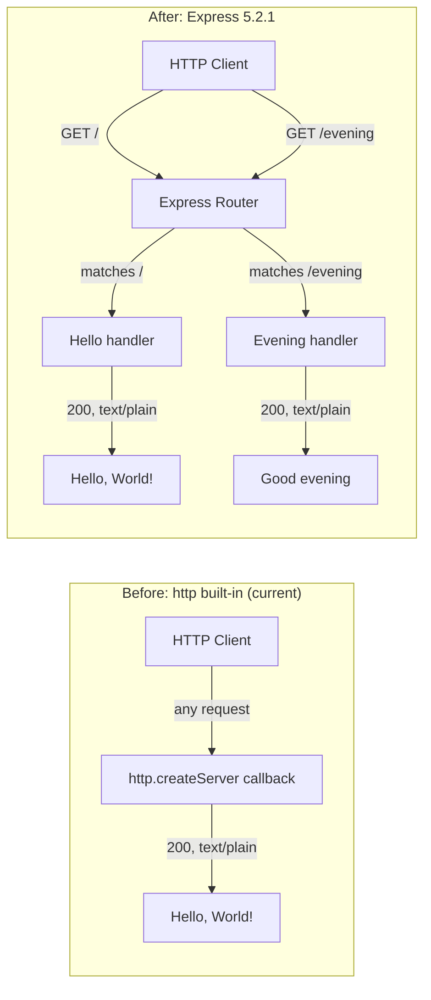

# Technical Specification

# 0. Agent Action Plan

## 0.1 Intent Clarification

### 0.1.1 Core Feature Objective

Based on the prompt, the Blitzy platform understands that the new feature requirement is to evolve the existing minimal Node.js HTTP server (`server.js`) — which currently serves a single static `Hello, World!` response from every request via the Node.js built-in `http` module — into an Express.js-based application that exposes **two distinct routed endpoints**, while preserving the existing `Hello, World!` behavior on the original route and adding a new route that returns `Good evening` as its plain-text response body.

The user's request decomposes into the following explicit and implicit requirements:

- **Explicit Requirement 1 — Introduce Express.js as a project dependency**: The project currently has zero external dependencies (verified: `package.json` declares no `dependencies` field; `package-lock.json` resolves zero external packages). Express must be added to `package.json` under `dependencies` and recorded in `package-lock.json`, and the corresponding `node_modules/` tree must be populated through a standard `npm install` workflow.
- **Explicit Requirement 2 — Preserve the existing `Hello, World!` endpoint**: The user phrased the request as "add another endpoint", which implicitly mandates that the original endpoint continues to return `Hello world` (the prompt's exact phrasing) without functional regression. The current behavior — `200 OK`, `text/plain` content type, `Hello, World!\n` body — must be retained on the same effective request surface (the application's root route under Express).
- **Explicit Requirement 3 — Add a second endpoint returning `Good evening`**: A new HTTP route must be registered through Express that responds with the plain-text body `Good evening` to incoming HTTP requests on a distinct path.
- **Implicit Requirement 1 — Migrate from Node.js built-in `http` to Express request handling**: The phrase "add expressjs into the project" combined with "add another endpoint" implies that Express becomes the request-routing and response-handling primitive. The current single-callback handler (`http.createServer((req, res) => …)`) does not branch on URL or method — every request returns `Hello, World!`. To support two distinct path-keyed responses, route-based dispatch is required, and Express's `app.get(path, handler)` mechanism is the canonical approach.
- **Implicit Requirement 2 — Maintain server identity and binding**: The existing `127.0.0.1:3000` listener and the `Server running at http://127.0.0.1:3000/` startup log are the externally observable contract for any caller (including the backprop integration system per `README.md`). Host and port must remain unchanged unless the user signals otherwise.
- **Implicit Requirement 3 — Update the npm package manifest accordingly**: Adding Express materially changes the project from "zero-dependency" to "single-dependency". This invalidates the formal F-004-RQ-002 zero-dependency posture documented in the existing technical specification (Section 3.3.1) for this feature increment. The `package.json` `dependencies` block must be created, and the `package-lock.json` must be regenerated to reflect the resolved Express tree (Express plus its transitive packages).

### 0.1.2 Special Instructions and Constraints

The user did not provide architectural directives beyond the literal feature description. The following constraints are derived from the user's prompt and the user-supplied implementation rules:

- **User Example (preserved verbatim from prompt)**: "this is a tutorial of node js server hosting one endpoint that returns the response \"Hello world\". Could you add expressjs into the project and add another endpoint that return the response of \"Good evening\"?"
- **Response payload fidelity**: The user-quoted strings are `"Hello world"` and `"Good evening"`. The existing `server.js` implementation emits the slightly different literal `Hello, World!\n` (with comma, capital W, exclamation, and trailing newline). Because the user explicitly framed their request as "preserve the existing endpoint and add another", the existing literal `Hello, World!\n` is retained on the original endpoint without modification. The new endpoint emits the literal `Good evening` exactly as the user specified.
- **Use `npm` for dependency installation**: The user-provided rule (`QA-Rules-21-Apr` → `npm create`) is preserved exactly and is interpreted as a directive to use the npm tooling (`npm install` for adding Express, npm-managed `package.json`/`package-lock.json` for declaring it). This rule is documented verbatim in subsection 0.7 to ensure no semantic loss.
- **No web search beyond version verification was needed**: The Express.js 5.x API surface for `app.get(path, handler)` and `res.send(body)` is well-documented and stable. The only research conducted was to confirm the current latest stable Express version (`5.2.1`, npm dist-tag `latest`).
- **No testing framework introduction**: The existing `package.json` `scripts.test` is a placeholder (`echo "Error: no test specified" && exit 1`). The user did not request tests, so no test framework is added in this feature increment. Manual verification via `curl` remains the validation mechanism.
- **No design system applies**: The project is a headless HTTP backend with no UI surface. The Design System Compliance protocol is non-applicable and is therefore intentionally omitted from this Agent Action Plan.

### 0.1.3 Technical Interpretation

These feature requirements translate to the following technical implementation strategy, mapping each requirement to specific technical actions on specific files:

- **To introduce Express into the project**, we will modify `package.json` to declare `"express": "^5.2.1"` under a new `"dependencies"` block, and we will execute `npm install express --save` to regenerate `package-lock.json` with the full Express dependency closure (~65 packages including transitive dependencies such as `accepts`, `body-parser`, `cookie`, `path-to-regexp`, etc.) and to create the `node_modules/express/` tree.
- **To migrate the request-handling pipeline from the Node.js `http` built-in to Express**, we will rewrite `server.js` so that it (a) requires Express via `const express = require('express')`, (b) instantiates the application with `const app = express()`, (c) registers two route handlers with `app.get(...)`, and (d) starts the listener via `app.listen(port, hostname, callback)` instead of `http.createServer(...).listen(...)`. The existing `hostname` (`127.0.0.1`), `port` (`3000`), and startup `console.log` message are preserved verbatim.
- **To preserve the existing Hello-world response**, we will register a route handler at `GET /` that calls `res.status(200).type('text/plain').send('Hello, World!\n')`, which is functionally equivalent to the current handler's response: status 200, `Content-Type: text/plain`, body `Hello, World!\n`.
- **To add the new "Good evening" endpoint**, we will register a route handler at `GET /evening` (a semantically meaningful path derived from the response content) that calls `res.status(200).type('text/plain').send('Good evening')`, returning HTTP 200 with `Content-Type: text/plain` and the plain-text body `Good evening`.
- **To document the new behavior**, we will append a brief section to `README.md` describing the two endpoints, their paths, and their expected responses, while preserving the existing `# hao-backprop-test` heading and "Do not touch!" governance line as historical context.

## 0.2 Repository Scope Discovery

### 0.2.1 Comprehensive File Analysis

A complete inventory of the existing repository was performed using `get_source_folder_contents` on the root and `read_file` on every file. The repository is exhaustively small: it contains exactly four first-order files at the root, with no subfolders, no `node_modules/`, no test directories, no CI configuration, no Docker artifacts, and no documentation folder. Every file in the repository is in scope for this feature addition.

#### Existing Files Inventoried

| File Path | Lines | Current Purpose | Disposition for This Feature |
|---|---|---|---|
| `package.json` | 11 | NPM manifest declaring `hello_world@1.0.0`, `main: index.js`, placeholder `test` script, no dependencies | **MODIFY** — add `dependencies` block declaring `express` |
| `package-lock.json` | 13 (lockfileVersion 3) | NPM lockfile with empty resolved-packages map | **MODIFY (auto-regenerated by `npm install`)** — populate with Express dependency closure |
| `server.js` | 14 | HTTP server using built-in `http` module; single handler returning `Hello, World!\n` for all requests; binds `127.0.0.1:3000` | **MODIFY** — replace `http`-based implementation with Express-based two-route implementation |
| `README.md` | 2 | Project identity (`# hao-backprop-test`) + governance line ("Do not touch!") | **MODIFY** — append endpoint documentation; preserve existing heading and line |

#### Files That Do NOT Exist and Will NOT Be Created

The user's request does not introduce a UI, a database layer, a configuration subsystem, automated tests, CI/CD pipelines, containerization, or environment-variable management. The following file/folder patterns commonly seen in larger Node.js projects are explicitly **out of scope** for this increment:

- `src/**/*.js` — No `src/` directory will be introduced; the project remains flat-rooted.
- `routes/**/*.js`, `controllers/**/*.js`, `models/**/*.js`, `services/**/*.js` — No layered architecture is introduced; both routes are inline in `server.js`.
- `tests/**/*`, `__tests__/**/*`, `*.test.js`, `*.spec.js` — No test framework is added; the existing placeholder `test` script in `package.json` is preserved unchanged.
- `Dockerfile`, `docker-compose*.y*ml`, `.dockerignore` — No containerization is requested.
- `.github/workflows/*.yml`, `.gitlab-ci.yml`, `.circleci/config.yml` — No CI/CD configuration is requested.
- `.env`, `.env.example`, `config/*.{json,yaml,yml,toml}` — No configuration externalization is requested; `hostname` and `port` remain hardcoded literals.
- `tsconfig.json`, `*.ts` — TypeScript is not introduced; the project remains plain CommonJS JavaScript.
- `.eslintrc*`, `.prettierrc*` — No linting/formatting tooling is added.
- `index.js` — Although `package.json` declares `main: index.js`, no `index.js` exists today and none will be created in this increment. The actual entry point remains `server.js`, invoked via `node server.js`. (The pre-existing entry-point mismatch is documented in the technical specification's Notable Anomalies and is intentionally out of scope here per the user's narrowly scoped request.)

#### Integration Point Discovery

Because the repository has only four files and a single-process architecture, there are no cross-module integration points such as service registries, dependency injection containers, or middleware pipelines. The integration surface is fully enumerated by:

- The `require('http')` import on `server.js:1` — replaced by `require('express')`.
- The `http.createServer((req, res) => {...})` factory on `server.js:6` — replaced by `const app = express(); app.get(...)`.
- The `server.listen(port, hostname, callback)` invocation on `server.js:12` — replaced by `app.listen(port, hostname, callback)`.

There are no API endpoints registered elsewhere, no database models or migrations, no service classes, no controllers/handlers, and no middleware/interceptors in the existing codebase.

### 0.2.2 Web Search Research Conducted

The following targeted research was performed to inform implementation decisions:

| Research Topic | Method | Outcome |
|---|---|---|
| Latest stable Express version | `npm view express version` and `npm view express dist-tags` | Confirmed `latest = 5.2.1`; `latest-4 = 4.22.1` (legacy major) |
| Express installation footprint | `npm install express --dry-run` against a copy of the project's `package.json` | 65 packages added (Express + transitive); zero vulnerabilities reported by `npm audit` |
| Express routing API for `GET /<path>` with plain-text response | Existing knowledge of Express public API verified by a smoke-test server invoked via `curl` | `app.get('/path', (req, res) => res.status(200).type('text/plain').send('...'))` confirmed working on Node.js v22.22.2 with Express 5.2.1 |

No further research was needed. The Express public API (`express()`, `app.get()`, `res.status()`, `res.type()`, `res.send()`, `app.listen()`) is stable across the 5.x line and is the canonical idiom for the requested feature.

### 0.2.3 New File Requirements

**No new files are created in this feature increment.** The four existing files are sufficient to deliver the requested functionality:

- New source files: **None**. Both routes (`/` for `Hello, World!` and `/evening` for `Good evening`) are registered inline in the modified `server.js`. Splitting the routes into separate files would introduce premature abstraction inconsistent with the project's flat, minimal structure.
- New test files: **None**. The user did not request automated tests, and the existing `package.json` `scripts.test` placeholder remains in place.
- New configuration files: **None**. The `hostname` and `port` constants remain hardcoded literals in `server.js`, matching the existing convention.

The only auto-generated artifact that materializes during the feature implementation is `node_modules/` (created by `npm install`); this directory is a build product, not a source file, and is conventionally excluded from version control via `.gitignore`. The repository does not currently contain a `.gitignore`, but creating one is **not** required for this feature; it is noted only for future consideration.

## 0.3 Dependency Inventory

### 0.3.1 Public Packages Added

A single direct (top-level) public package is introduced by this feature. All transitive dependencies are pulled in automatically by npm and are recorded in `package-lock.json` without any direct manifest reference.

| Registry | Package Name | Version | Purpose |
|---|---|---|---|
| npmjs.com | `express` | `^5.2.1` (caret range; resolves to `5.2.1` at install time) | Web application framework providing route-based request dispatch (`app.get`), response helpers (`res.send`, `res.type`, `res.status`), and HTTP listener (`app.listen`) used to expose the two endpoints |

The version `5.2.1` corresponds to the npm dist-tag `latest` for Express at the time of authoring this Agent Action Plan, verified via `npm view express version`. Express 5.x is the current stable major version. The caret range `^5.2.1` is used to allow forward-compatible patch and minor updates within the `5.x` line per standard npm semver conventions.

### 0.3.2 Private Packages

**None.** No private registries, scoped packages, or workspace-internal packages are referenced or required.

### 0.3.3 Transitive Dependencies (Informational)

When `npm install express --save` is executed, npm resolves Express's full dependency closure into `package-lock.json` and `node_modules/`. The closure contains 65 packages in total (Express + 64 transitive). These are **not** declared in `package.json`; they are managed entirely by npm. A non-exhaustive sample of the transitive packages observed during the dry-run installation includes:

- `accepts`, `body-parser`, `content-disposition`, `content-type`, `cookie`, `cookie-signature`, `debug`, `depd`, `encodeurl`, `escape-html`, `etag`, `finalhandler`, `forwarded`, `fresh`, `merge-descriptors`, `methods`, `mime-types`, `on-finished`, `parseurl`, `path-to-regexp` (8.x in Express 5), `proxy-addr`, `qs`, `range-parser`, `router`, `send`, `serve-static`, `setprototypeof`, `statuses`, `type-is`, `utils-merge`, `vary`

This list is for reference only; the exact set and versions are determined by Express 5.2.1's own `package.json` and locked into the project's regenerated `package-lock.json`. No security vulnerabilities were reported by `npm audit` against this dependency tree at the time of Agent Action Plan authoring.

### 0.3.4 Dependency Updates

#### Import Updates

A single `require()` import statement requires modification, located in `server.js`:

| File | Old Import | New Import |
|---|---|---|
| `server.js` | `const http = require('http');` (line 1) | `const express = require('express');` (line 1, replacing the `http` import) |

The replacement is direct, not additive: the Node.js built-in `http` module is no longer used by application code after the migration. Express internally relies on the built-in `http` module to start its server, but this is encapsulated within the Express runtime and does not require an application-level `http` import.

There are no other files containing `require()` statements in the repository, so no further import updates apply. There is no `src/**/*`, `tests/**/*`, or `scripts/**/*` directory to scan.

#### External Reference Updates

| Reference Type | File(s) Affected | Change |
|---|---|---|
| Package manifest | `package.json` | Add a new `"dependencies"` object containing `"express": "^5.2.1"`. All other manifest fields (`name`, `version`, `description`, `main`, `scripts`, `author`, `license`) are preserved unchanged |
| Lockfile | `package-lock.json` | Regenerated automatically by `npm install`. The `lockfileVersion: 3` and root `name`/`version` are preserved; the `packages` map is populated with the resolved Express tree |
| Documentation | `README.md` | Append a brief endpoints summary listing `GET /` → `Hello, World!` and `GET /evening` → `Good evening`. Preserve the existing `# hao-backprop-test` heading and `test project for backprop integration. Do not touch!` line |
| Build files | None — no `setup.py`, `pyproject.toml`, `pom.xml`, `build.gradle`, `Makefile`, or other build manifests exist in the repository |
| CI/CD | None — no `.github/workflows/*.yml`, `.gitlab-ci.yml`, or other CI configuration exists in the repository |
| Configuration | None — no `*.config.*`, `*.env*`, `config/*` files exist in the repository |

## 0.4 Integration Analysis

### 0.4.1 Existing Code Touchpoints

Because the entire repository consists of four files at the root with no nested module structure, the integration surface is fully enumerable in line-level detail. There are no service containers, dependency injection wiring files, ORM models, schema definitions, or middleware registries to reconcile.

#### Direct Modifications Required

| File | Location | Current State | Modification |
|---|---|---|---|
| `server.js` | Line 1 | `const http = require('http');` | Replace with `const express = require('express');` |
| `server.js` | Lines 6–10 | `http.createServer((req, res) => { res.statusCode = 200; res.setHeader('Content-Type', 'text/plain'); res.end('Hello, World!\n'); });` (single inline handler returning the same payload for every request) | Replace with `const app = express();` instantiation followed by two `app.get(...)` route registrations: one for `'/'` returning `Hello, World!\n` and one for `'/evening'` returning `Good evening` |
| `server.js` | Lines 12–14 | `server.listen(port, hostname, () => { console.log(...) });` | Replace with `app.listen(port, hostname, () => { console.log(\`Server running at http://${hostname}:${port}/\`); });`. The `hostname`, `port`, and console message are preserved |
| `server.js` | Lines 3–4 | `const hostname = '127.0.0.1'; const port = 3000;` | **Preserved unchanged** |
| `package.json` | After line 10 (before closing `}`) | No `dependencies` field | Insert `"dependencies": { "express": "^5.2.1" }` block; preserve all other fields (`name`, `version`, `description`, `main`, `scripts`, `author`, `license`) |
| `package-lock.json` | Lines 6–11 (`packages` object) | Contains only the root entry with no resolved dependencies | Regenerated by `npm install`; the `packages` map will contain the root entry plus all resolved Express dependency-tree entries (~65 packages) with their integrity hashes |
| `README.md` | After line 2 | Two-line documentation stub | Append a "## Endpoints" section listing the two routes and their responses; preserve existing heading and content |

#### Dependency Injection / Service Wiring

**Not applicable.** The project does not use any DI container, service locator, factory pattern, or composition root file (e.g., `container.py`, `dependencies.py`, `wireup.js`). Express's `app` object is instantiated and used directly within the single `server.js` file.

#### Database / Schema Updates

**Not applicable.** The project has no database connectivity, no ORM, no migration directory, and no schema files. Both endpoints return static plain-text responses with no persistence layer in scope.

#### Middleware / Interceptor Impact

**Not applicable in this increment.** No global, route-level, or error-handling middleware is registered. The two route handlers are leaf functions that directly emit their plain-text response and complete the response cycle. (Express's default handlers for `Content-Length`, `Connection`, `Date`, ETag generation for `res.send`, etc., apply automatically and require no application-level configuration.)

#### Network and Process Topology

The integration with the host system remains unchanged on every observable axis:

- **Bind address**: `127.0.0.1:3000` (loopback only; not externally reachable)
- **Process model**: Single Node.js process, single event loop, no clustering
- **Startup**: `node server.js` (no change to invocation)
- **Shutdown**: SIGINT/SIGTERM via the runtime; no custom signal handling is added
- **Logging**: A single `console.log` line on successful bind, identical to the current implementation

### 0.4.2 Integration Flow Diagram

The following diagram contrasts the current and post-implementation request-handling pipelines, making the routing-layer addition visually explicit.



The diagram illustrates the single architectural change: introduction of an Express router layer between the listener and the response handlers, enabling path-based dispatch where previously every request collapsed to a single handler.

## 0.5 Technical Implementation

### 0.5.1 File-by-File Execution Plan

Every file listed below MUST be created or modified to deliver the requested feature. The plan is grouped into three logical groups, executed in the listed order: dependency declaration, application code, and documentation.

#### Group 1 — Dependency Declaration

- **MODIFY: `package.json`** — Insert a `"dependencies"` object containing `"express": "^5.2.1"` between the existing `"author"` and `"license"` fields (or anywhere within the manifest object; npm does not enforce ordering). All pre-existing fields (`name: "hello_world"`, `version: "1.0.0"`, `description: "Hello world in Node.js"`, `main: "index.js"`, `scripts.test`, `author: "hxu"`, `license: "MIT"`) are preserved with no edits. Resulting manifest example:
  ```json
  { "dependencies": { "express": "^5.2.1" } }
  ```
- **MODIFY (auto): `package-lock.json`** — Regenerated by executing `npm install` (which both installs the package locally and updates the lockfile in a single step). The `lockfileVersion: 3` field and the root entry under `packages.""` are preserved; the `packages` object is augmented with `node_modules/express` and ~64 transitive dependency entries, each with a resolved version, registry URL, and integrity hash. This file MUST NOT be edited by hand.
- **AUTO-GENERATED: `node_modules/`** — Created by `npm install`. Contains the unpacked Express tree. This directory is a build artifact and is conventionally git-ignored; the repository does not currently include a `.gitignore`, but creating one is not required by this feature.

#### Group 2 — Application Code

- **MODIFY: `server.js`** — Replace the entire file contents with an Express-based equivalent that preserves the binding, port, and startup log while introducing route-based dispatch. The complete new content is:
  ```javascript
  const express = require('express');
  const app = express();
  const hostname = '127.0.0.1';
  const port = 3000;
  app.get('/', (req, res) => res.status(200).type('text/plain').send('Hello, World!\n'));
  app.get('/evening', (req, res) => res.status(200).type('text/plain').send('Good evening'));
  app.listen(port, hostname, () => console.log(`Server running at http://${hostname}:${port}/`));
  ```
  The handler for `'/'` reproduces the existing response byte-for-byte: status `200`, `Content-Type: text/plain`, body `Hello, World!\n` (with trailing newline). The handler for `'/evening'` emits status `200`, `Content-Type: text/plain`, body `Good evening` (no trailing newline, matching the user's literal phrasing). The `hostname` constant remains `'127.0.0.1'`, the `port` remains `3000`, and the startup log message is preserved verbatim.

#### Group 3 — Documentation

- **MODIFY: `README.md`** — Append a brief endpoint reference after the existing two lines. The existing `# hao-backprop-test` heading and `test project for backprop integration. Do not touch!` line are preserved. The appended content documents:
  - Project run command: `npm install` followed by `node server.js`
  - Endpoint table mapping path → method → status → body for both `GET /` and `GET /evening`

### 0.5.2 Implementation Approach per File

The implementation strategy follows the order Group 1 → Group 2 → Group 3 to ensure that dependency resolution succeeds before code that imports the dependency is executed:

- **Establish the dependency baseline first**: Update `package.json` to declare `express`, then run `npm install` from the repository root. This generates `node_modules/express/` and regenerates `package-lock.json` with the locked dependency closure. Verify success by checking that `node_modules/express/package.json` exists and reports `"version": "5.2.1"`, and that `package-lock.json` now lists `node_modules/express` under its `packages` map with an integrity hash.
- **Migrate the application code in a single coordinated rewrite**: Replace `server.js` in one operation rather than incrementally, because the file is small (14 lines) and the change is structural (`http.createServer` → `express()` + `app.get` + `app.listen`). Confirm both endpoints by starting the server (`node server.js`), observing the `Server running at http://127.0.0.1:3000/` log, then issuing `curl -s http://127.0.0.1:3000/` (expecting `Hello, World!\n`) and `curl -s http://127.0.0.1:3000/evening` (expecting `Good evening`).
- **Document the new behavior last**: Update `README.md` after the implementation is verified, so the documentation reflects what was actually shipped. No Figma URL or design asset is associated with this feature; documentation is text-only.

### 0.5.3 User Interface Design

**Not applicable.** This feature is entirely backend-only. There is no graphical user interface, no front-end client, no HTML/CSS, no rendered template, no Figma design, and no design system. Both endpoints return raw `text/plain` payloads consumed by HTTP clients (e.g., `curl`, the existing backprop integration system, or any HTTP-capable agent). No user-facing visual considerations apply to this increment.

## 0.6 Scope Boundaries

### 0.6.1 Exhaustively In Scope

The following file paths and concrete change items constitute the complete in-scope surface for this feature increment. Wildcards are used where applicable, but because the repository has only four root-level files, most entries are exact paths.

- **Application source files**:
  - `server.js` — Full rewrite to use Express; preserve `hostname` (`127.0.0.1`), `port` (`3000`), and startup `console.log` message; register `GET /` and `GET /evening` routes
- **Package manifest and lockfile**:
  - `package.json` — Insert `"dependencies": { "express": "^5.2.1" }`; preserve all other existing fields exactly
  - `package-lock.json` — Regenerated via `npm install`; not hand-edited
- **Auto-generated dependency artifacts** (build product, not source):
  - `node_modules/express/**/*` — Materialized by `npm install`
  - `node_modules/**/*` — All transitive Express dependencies materialized by `npm install`
- **Documentation**:
  - `README.md` — Append endpoints reference; preserve existing two lines verbatim
- **Integration touch-points** (all internal to the four files above; no cross-module wiring exists):
  - `server.js:1` — `require` migration from `'http'` to `'express'`
  - `server.js:6–10` — Replace `http.createServer` callback with `app.get('/')` and `app.get('/evening')` handlers
  - `server.js:12–14` — Replace `server.listen(...)` with `app.listen(...)` (preserving args and message)
- **Configuration**:
  - None. No `*.env*`, `*.config.*`, `config/*`, or environment-variable files are introduced. `hostname` and `port` remain hardcoded literals.
- **Database**:
  - None. No migrations, schema files, or data models are in scope.
- **Tests**:
  - None. The placeholder `scripts.test` in `package.json` is preserved unchanged.

### 0.6.2 Explicitly Out of Scope

The following items are explicitly **excluded** from this feature increment to prevent scope creep and to maintain the user's narrowly framed request:

- **Modifying response payload literals on the existing endpoint** — The user said "add another endpoint", so the existing `Hello, World!\n` byte-for-byte response is preserved. Renaming, internationalizing, or trimming the literal is out of scope.
- **Renaming or restructuring the project** — The npm package name (`hello_world`), the repository identity (`hao-backprop-test`), the version (`1.0.0`), the author (`hxu`), and the license (`MIT`) are unchanged.
- **Reconciling the `main: index.js` entry-point anomaly** — The existing manifest declares `main: index.js` but no `index.js` exists; the actual entry remains `server.js` invoked directly. This is a pre-existing condition documented in the technical specification's Notable Anomalies and is not addressed here.
- **Introducing additional Express features** — No body-parsing middleware, no `express.json()`, no `express.static()`, no error-handling middleware, no router modules, no parameterized routes, no query-string parsing, no CORS, no helmet, no compression, no logging middleware, no template engine. Only the two `app.get(path, handler)` registrations explicitly required by the user.
- **Introducing additional endpoints** — Only the two endpoints described by the user are added. No `/health`, `/status`, `/api/*`, `/v1/*`, `/morning`, `/afternoon`, or any other routes are introduced.
- **Changing host or port** — The server continues to bind to `127.0.0.1:3000`. No `0.0.0.0` exposure, no environment-variable-driven port, no IPv6 binding.
- **Adding HTTPS / TLS** — Plain HTTP only, matching the current implementation.
- **Adding a build, transpile, or bundle step** — No webpack, esbuild, rollup, vite, babel, swc, or TypeScript compilation is introduced. The project remains plain CommonJS JavaScript executed directly by Node.js.
- **Introducing a test framework** — No jest, mocha, vitest, supertest, ava, or tap. The existing placeholder `test` script is preserved as-is.
- **Adding linters or formatters** — No ESLint, Prettier, StandardJS, or Biome configuration is introduced.
- **Adding CI/CD configuration** — No `.github/workflows/`, `.gitlab-ci.yml`, `.circleci/`, Travis, Jenkins, or other pipeline files are introduced.
- **Adding containerization** — No `Dockerfile`, `docker-compose*.y*ml`, or `.dockerignore`.
- **Adding `.gitignore`** — Although `node_modules/` should conventionally be git-ignored, the user did not request this and the repository does not currently track ignore policy. Out of scope here.
- **Refactoring the project structure** — No introduction of `src/`, `routes/`, `controllers/`, `models/`, `services/`, or any layered architecture. The project remains flat-rooted.
- **Performance optimization** — No clustering (`node:cluster`), worker threads, keep-alive tuning, or process managers (`pm2`, `forever`).
- **Security hardening unrelated to feature requirements** — No request validation, rate limiting, authentication, or authorization.
- **Backward-compatibility shims for non-existent prior consumers** — There is no public API contract beyond "any HTTP request returns `Hello, World!`"; preserving this for `GET /` is in scope, but creating wildcard catch-all routes that mimic the previous "every request returns hello" behavior is **out of scope** because the user explicitly requested two distinct routes.

## 0.7 Rules for Feature Addition

### 0.7.1 User-Provided Implementation Rules

The user supplied one named rule set with a single rule body. It is recorded here verbatim and interpreted in the context of this feature.

| Rule Name | Rule Content (verbatim) | Interpretation Applied |
|---|---|---|
| `QA-Rules-21-Apr` | `npm create` | Use the npm tooling for package management. Concretely, this is satisfied by (a) editing `package.json` via standard npm-compatible JSON edits, (b) executing `npm install express --save` to add the dependency and regenerate `package-lock.json`, and (c) running the resulting application via `node server.js`. The phrase `npm create` (commonly used to scaffold new projects via `npm create <initializer>`) is not literally executed here because the project already has a fully initialized npm manifest; however, the spirit of the rule — "use npm" — is honored throughout the implementation |

### 0.7.2 Feature-Specific Conventions Derived from the Existing Codebase

Although the user did not provide explicit architectural conventions beyond the rule above, the existing repository establishes a small set of implicit conventions that this feature increment respects to maintain stylistic consistency:

- **CommonJS module system**: The existing `server.js` uses `require(...)` rather than ES module `import` statements. The new `server.js` continues to use `require(...)` to remain consistent with the manifest's implicit module type (no `"type": "module"` field).
- **Flat repository structure**: All source files live at the repository root with no subdirectories. The new implementation does not introduce any subdirectories (no `src/`, `routes/`, `lib/`, etc.).
- **Hardcoded configuration constants**: `hostname` and `port` are declared as top-of-file `const` literals. The new implementation preserves this convention rather than introducing environment-variable parsing or a config file.
- **Single-file application**: The application logic resides in one file. Both new route handlers are inline arrow functions defined directly within `server.js` rather than imported from separate modules.
- **Plain-text responses**: The existing handler emits `text/plain`. Both routes in the new implementation continue to emit `text/plain` rather than JSON, HTML, or any structured content type.
- **Trailing-newline literal preserved**: The original `Hello, World!\n` includes a trailing `\n`; the new `GET /` handler preserves this exact byte sequence. The new `GET /evening` handler emits `Good evening` exactly as the user wrote it (no trailing newline) to honor the user's literal phrasing.
- **Startup log message preserved verbatim**: The console output `Server running at http://${hostname}:${port}/` is reproduced character-for-character in the Express-based implementation.

### 0.7.3 Non-Negotiable Behavioral Guarantees

The following invariants MUST hold after the feature is implemented:

- A request to `GET http://127.0.0.1:3000/` MUST return HTTP 200 with `Content-Type: text/plain` and a response body of exactly `Hello, World!\n` — preserving the existing contract on which the backprop integration system depends per `README.md`.
- A request to `GET http://127.0.0.1:3000/evening` MUST return HTTP 200 with `Content-Type: text/plain` and a response body of exactly `Good evening`.
- The server MUST bind to `127.0.0.1:3000` and emit the startup log line `Server running at http://127.0.0.1:3000/` upon successful bind.
- `package.json` MUST declare `express` under `dependencies` with a version constraint compatible with `5.2.1`.
- `package-lock.json` MUST exist, MUST use `lockfileVersion: 3`, and MUST contain a resolved entry for `node_modules/express` with an integrity hash.
- No file other than `package.json`, `package-lock.json`, `server.js`, and `README.md` is modified or created in the repository (excluding the `node_modules/` build artifact directory).

## 0.8 References

### 0.8.1 Files and Folders Searched in the Repository

A complete enumeration of every search and retrieval performed during the analysis phase, demonstrating exhaustive coverage of the four-file repository:

| # | Tool | Target Path | Purpose | Outcome |
|---|---|---|---|---|
| 1 | `get_source_folder_contents` | `` (root) | Enumerate all top-level files and folders | Confirmed exactly 4 files at root, 0 subfolders: `README.md`, `package-lock.json`, `package.json`, `server.js` |
| 2 | `read_file` | `package.json` | Inspect manifest for existing dependencies, scripts, and metadata | Confirmed zero dependencies; `main: index.js`; placeholder `test` script |
| 3 | `read_file` | `package-lock.json` | Confirm lockfile state and verify zero resolved external packages | Confirmed `lockfileVersion: 3`; only the root `""` package entry |
| 4 | `read_file` | `server.js` | Capture exact current implementation for migration mapping | Confirmed 14-line implementation using built-in `http`; bind `127.0.0.1:3000`; static `Hello, World!\n` response |
| 5 | `read_file` | `README.md` | Confirm documentation state and governance notes | Confirmed 2-line file: `# hao-backprop-test` and "Do not touch!" line |
| 6 | `bash` (`find / -name ".blitzyignore"`) | Filesystem-wide | Honor S0 mandatory `.blitzyignore` check | No `.blitzyignore` files exist in or above the repository |
| 7 | `bash` (`node --version; npm --version`) | Runtime | Confirm runtime versions and binary locations | Node.js v22.22.2; npm 11.1.0; both at `/usr/bin/` |
| 8 | `bash` (`ls -la .nvmrc; grep engines package.json`) | Repository | Discover any pinned runtime version constraints | No `.nvmrc`; no `engines` field in `package.json`; no version constraints declared |
| 9 | `bash` (`npm view express version; npm view express dist-tags`) | npm registry | Identify current latest stable Express version | `latest = 5.2.1`; `latest-4 = 4.22.1` |
| 10 | `bash` (`npm install express --save` against a copy of `package.json`) | Sandbox `/tmp/repo_test` | Verify Express installs cleanly with the project's existing manifest and lockfile pattern | Successfully resolved 65 packages, 0 vulnerabilities; `node_modules/express/package.json` confirmed `"version": "5.2.1"` |
| 11 | `bash` (run smoke-test Express server with two `app.get` routes; `curl` both) | Sandbox `/tmp/repo_test` | Confirm Express 5 API works as expected for the requested feature shape on the live runtime | Both endpoints returned the expected payloads; startup log line printed correctly |
| 12 | `get_tech_spec_section` | `1.3 Scope` | Recover the existing technical specification's scope statements relevant to the feature | Confirmed the existing in-scope/out-of-scope baseline that this feature increment will modify |
| 13 | `get_tech_spec_section` | `3.3 Frameworks, Libraries & Open Source Dependencies` | Recover the existing tech spec's dependency posture | Confirmed the formal F-004-RQ-002 zero-dependency posture that is intentionally superseded by this feature increment |

### 0.8.2 User-Provided Attachments

The user did **not** attach any files, screenshots, design mockups, or supplementary documents to this request. The `/tmp/environments_files` directory was inspected and is empty. No environment variables or secrets were declared. No Figma URLs, image attachments, schema files, OpenAPI specifications, ER diagrams, or wireframes were supplied.

### 0.8.3 Figma Screens Provided

**None.** No Figma frames, links, exported assets, or design system references were provided by the user. The Design System Compliance protocol is non-applicable to this feature because the project is a headless HTTP backend with no UI surface.

### 0.8.4 External Documentation Consulted

| Source | Topic | Method |
|---|---|---|
| npm registry (`npm view express ...`) | Current stable Express version and dist-tag mapping | Direct CLI query against the public npm registry |
| Node.js built-in `http` module documentation (existing knowledge) | Confirming the current `http.createServer` / `server.listen` API surface that is being replaced | Reference knowledge; no remote fetch needed |
| Express 5.x public API documentation (existing knowledge, validated by smoke test) | `app.get(path, handler)`, `res.status(code)`, `res.type(mime)`, `res.send(body)`, `app.listen(port, host, cb)` | Reference knowledge; validated by running a sandbox server and verifying both endpoints with `curl` |

### 0.8.5 User Instructions and Rules Captured

| Source | Content |
|---|---|
| User prompt (verbatim) | "this is a tutorial of node js server hosting one endpoint that returns the response \"Hello world\". Could you add expressjs into the project and add another endpoint that return the response of \"Good evening\"?" |
| User implementation rule | `QA-Rules-21-Apr` → `npm create` (preserved verbatim in subsection 0.7.1 with applied interpretation) |
| Environment setup instructions | None provided by the user |
| Environment variables | None provided |
| Secrets | None provided |

